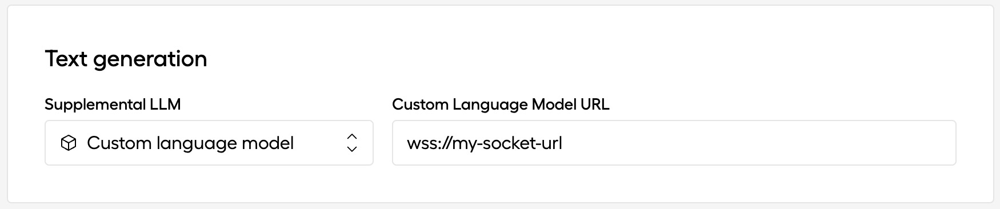

# EVI Custom Language Model Example Socket

This guide provides a step-by-step example to configure an EVI custom language model.

## Prerequisites

Before starting, ensure you have the following prerequisites installed on your system:
- Python
- Poetry
- Uvicorn
- Ngrok
- LangChain

For detailed instructions on how to set these up, [see this guide.](./docs/detailed-install-instructions-mac.md)

## Setup Steps

### 1. Start the socket

First, you need to spin up the socket which will be used by EVI. Open your terminal and navigate to the project directory. Run the following command to start Uvicorn with live reloading:

```bash
poetry run uvicorn main:app --reload
```

### 2. Put socket behind Ngrok

To make the socket accessible over the internet, you will use Ngrok. In a new terminal window, route the Uvicorn server through Ngrok by executing:

```bash
ngrok http 8000
```

Note: Replace `8000` with your Uvicorn server's port if it's different.

Note the Ngrok URL where it says `Forwarding`. It should appear something like this:

`https://c021-2601-58b-1300-2100-d187-57d6-8104-a85c.ngrok-free.app`

### 3. Create a voice configuration that specifies the socket

In Hume's web portal, visit the Voice Configurations in the left navigation bar, or you can access it directly at https://beta.hume.ai/voice.

Create a new voice configuration, give it a name and optionally a system prompt, and then use the following dropdown to specify `Custom language model` and specify the `wss` address of your socket as given by Ngrok in the previous step:



### 4. Connect to the socket

With the configuration ID, you can now connect to EVI using your custom language model. Use the query parameter to pass the `config_id` argument, which is the ID shown for the voice configuration you created in the previous step. For example, if this were `config-gIblKUsH80lrH4NDs7uLy`, the URL would be:

```
wss://api.hume.ai/v0/assistant/chat?config_id=config-gIblKUsH80lrH4NDs7uLy&api_key=<Your API Key>
```

Remember to change the `config_id` with the configuration ID you created in step 2, and also replace `<Your API Key>` with your actual API key.

## You're done!

You have now successfully set up the server for the AI Assistant API. If you encounter any issues during the setup process, please consult the troubleshooting section or contact support.

---

## How it works

This agent combines web searches and context-aware response generation to provide real time data for EVI.

### Initialization and Configuration

Upon instantiation, the agent is configured with a `system_prompt`. This prompt sets the initial context or "personality" of the agent, guiding its tone and approach in conversations. The system prompt ensures that the agent's responses align with the intended user experience.

### Integration with External Tools

The agent leverages `load_tools` to integrate external functionalities, specifically `serpapi` for web searches. These tools extend the agent's capabilities beyond basic text generation, allowing it to fetch and incorporate external data into conversations.

### Language Model and Response Generation

The agent uses OpenAI's chat models, accessed via the `ChatOpenAI` interface. The integration of a chat prompt from `hub.pull` refines the agent's conversational style, ensuring that responses are not only relevant but also engaging and consistent with the defined conversational context.

### Processing and Response Workflow

- **Message Reception and Parsing**: The agent receives messages through a WebSocket connection. Each message is parsed to extract the user's intent and any contextual information from the conversation history.
- **Enhancing Responses with Prosody**: For voice interactions, the agent can enhance responses with prosody information, such as tone and emphasis, making the conversation more natural and engaging.
- **Dynamic Response Generation**: Utilizing the language model and external tools, the agent dynamically generates responses. This process considers the current conversation context, user intent, and any relevant external information fetched through integrated tools.
- **Conversational Context Management**: Throughout the interaction, the agent maintains a conversational context, ensuring that responses are coherent and contextually appropriate. This involves managing a chat history that informs each subsequent response.

### Number to Words Conversion

A unique feature of our agent is its ability to convert numbers in responses to their word equivalents, enhancing readability and naturalness in conversations. This is particularly useful in voice interfaces, where spoken numbers can sometimes hinder comprehension.

---

## About the WebSocket implementation

WebSockets provide an efficient and persistent connection between the client and server, allowing data to be exchanged as soon as it's available without the need to establish a new connection for each message.

### FastAPI and WebSocket Setup

The agent uses FastAPI, a modern web framework for building APIs with Python 3.7+, which includes support for WebSockets. The `main.py` file includes a WebSocket route that listens for incoming WebSocket connections at the `/llm` endpoint.

### WebSocket Connection Lifecycle

1. **Connection Establishment**: The client initiates a WebSocket connection to the server by sending a WebSocket handshake request to the `/llm` endpoint. The server accepts this connection with `await websocket.accept()`, establishing a full-duplex communication channel.

2. **Receiving Messages**: Once the connection is established, the server enters a loop where it listens for messages from the client using `await websocket.receive_text()`. This asynchronous call waits for the client to send a message through the WebSocket connection.

3. **Processing Messages**: Upon receiving a message, the server (specifically, the agent in this case) processes it. This involves:
   - Deserializing the received JSON string to extract the message and any associated data.
   - Parsing the message and any conversational context to understand the user's intent.
   - Generating an appropriate response using the agent's logic, which may involve querying external APIs, performing computations, or simply crafting a reply based on the conversation history.

4. **Sending Responses**: The generated response is sent back to the client through the same WebSocket connection using `await websocket.send_text(response)`. This allows for immediate delivery of the response to the user.

5. **Connection Closure**: The connection remains open for continuous exchange of messages until either the client or server initiates a closure. The server can close the connection using `await websocket.close()`, though in practice, for a conversational agent, the connection often remains open to allow for ongoing interaction.

### Example WebSocket Communication Flow

1. The client (a web app) establishes a WebSocket connection to the server at `wss://example.com/llm`.
2. The user sends a message through the client interface, which is then forwarded to the server via the WebSocket connection.
3. The server receives the message, and the agent processes it, generating a response.
4. The response is sent back to the client through the WebSocket, and the user sees the response in the client interface.
5. Steps 2-4 repeat for each message sent by the user, creating a conversational experience.