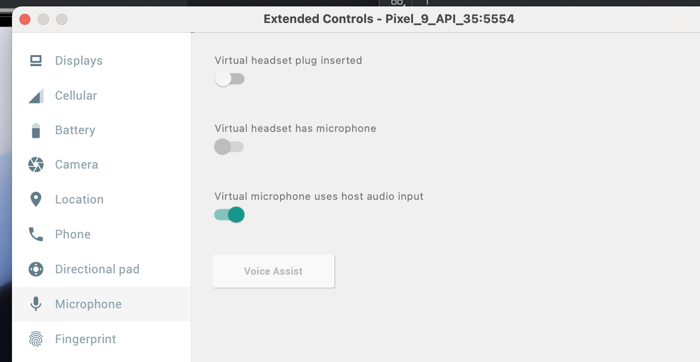

  
  <h1>Empathic Voice Interface | Sample Flutter App</h1>

This project features a sample implementation of Hume's [Empathic Voice Interface](https://hume.docs.buildwithfern.com/docs/empathic-voice-interface-evi/overview) using Flutter. This is lightly adapted from the stater project provided by `flutter create`.

**Targets:** The example supports iOS, Android, and Web. 

**Dependencies:** It uses the [record](https://pub.dev/packages/record) Flutter package for audio recording, and [audioplayers](https://pub.dev/packages/audioplayers) package for playback. 

## Instructions

1. `flutter pub get` to install dependencies.

2. Replace `humeApiKey` and (optional) `humeConfigId` constants in `lib/main.dart`. See our documentation on [getting your api keys](https://hume.docs.buildwithfern.com/docs/introduction/getting-your-api-key).

    **Note:** in a production flutter app, you should not hardcode the Hume API key into the client code, the client should fetch an access token from an endpoint on your server. You should supply
    the `MY_SERVER_AUTH_URL` environment variable and uncomment the call to `fetchAccessToken` in `lib/main.dart`.

3. Use `flutter run` to start the app!

4. If you are using the Android emulator, make sure to send audio to the emulator from the host.

## Notes

* **Echo cancellation**. Echo cancellation is important for a good user experience using EVI. Without echo cancellation, EVI will detect its own speech as user interruptions, and will cut itself off and become incoherent. This flutter example *requests* echo cancellation from the browser or the device's operating system, but echo cancellation is hardware-dependent and may not be provided in all environments.
  * Echo cancellation works consistently on physical iOS devices and on the web.
  * Echo cancellation works on some physical Android devices.
  * Echo cancellation doesn't seem to work using the iOS simulator or Android Emulator when forwarding audio from the host.
  * If you need to test using a simulator or emulator, or in an environment where echo cancellation is not provided, use headphones, or enable the mute button while EVI is speaking.
