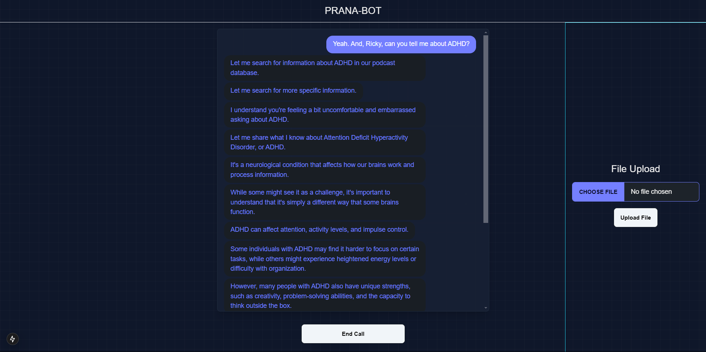
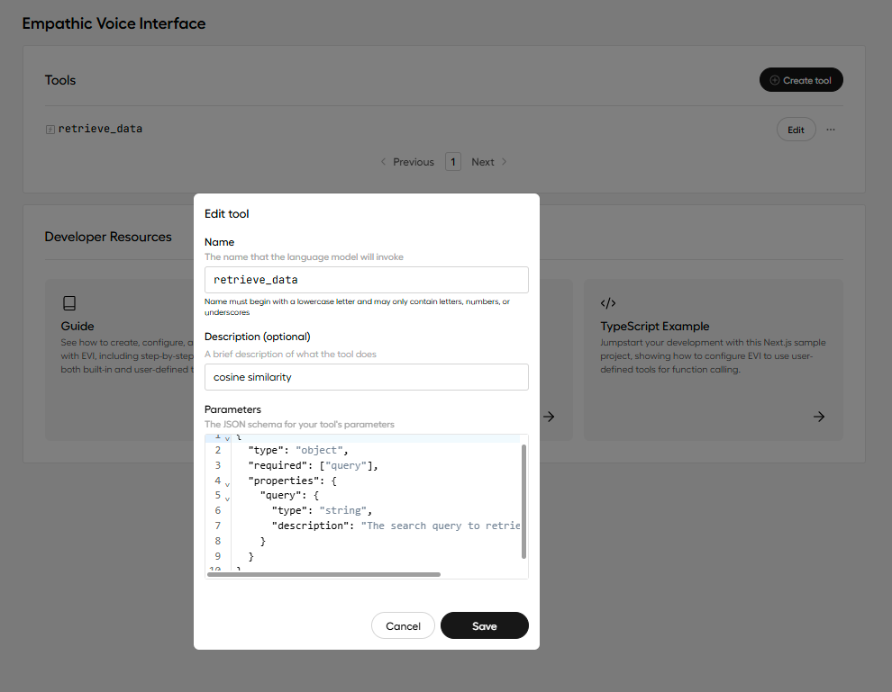

# Prana

Prana Bot uses Hume AI and function calling in order to create Retrieval-Augmented Generation workflow operated by a voice interface

[Blog](https://www.khedekar.tech/blog/Deep-RL/hume.html)

[Live](https://prana-client.vercel.app/)



## Start the project

```bash
npm install
```

```bash
cp .env.example .env
```

## Tool Schema

Remember the name of tool to be same in handleToolCall function in my case its “retrieve_data”



```json
{
  "type": "object",
  "required": ["query"],
  "properties": {
    "query": {
      "type": "string",
      "description": "The search query to retrieve podcast data."
    }
  }
}
```

```bash
npm run dev
```
