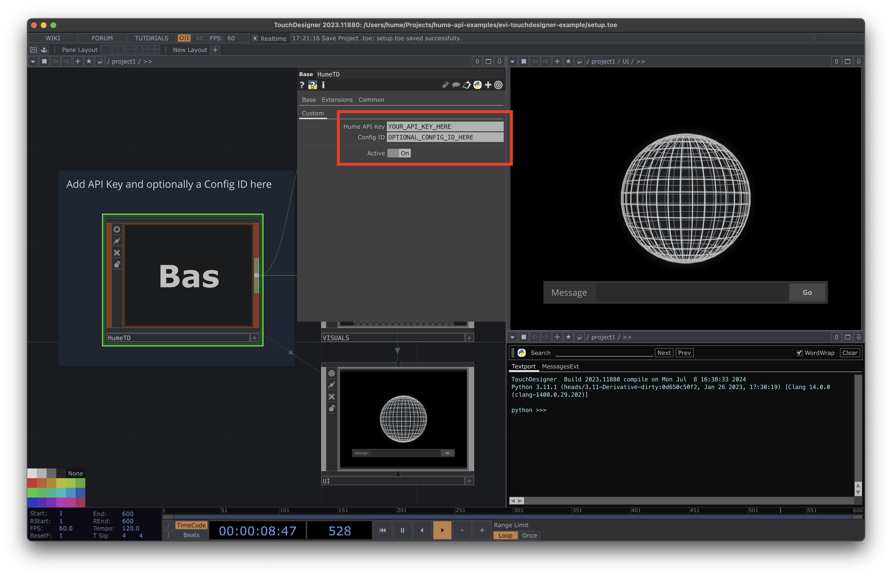

  
  <h1>EVI TouchDesigner Example</h1>

## Overview

This project demonstrates a sample implementation of Hume AI's [Empathic Voice Interface](https://hume.docs.buildwithfern.com/docs/empathic-voice-interface-evi/overview) within a TouchDesigner environment. For now, this project uses text input only.

## Setup

1. Acquire your API key from [platform.hume.ai](https://platform.hume.ai/settings/keys)
2. Add your API key to the HumeTD component
3. *Optional:* Add a config id with a custom configuration

## Using HumeTD

1. Ensure you have the Script folder in the same directory as your project
2. You can send a message from anywhere in your project using `op.HumeTD.Send_user_message('Your message here')`