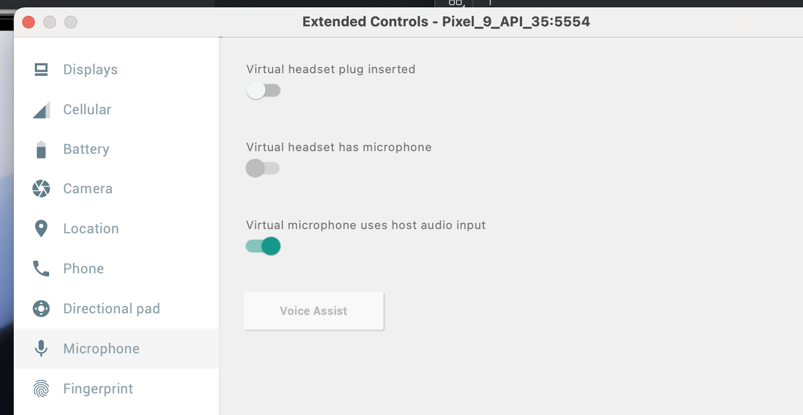

<div align="center">
  
  <h1>Empathic Voice Interface | Sample Flutter App</h1>
</div>

This project features a sample implementation of Hume's [Empathic Voice Interface](https://dev.hume.ai/docs/empathic-voice-interface-evi/overview) using Flutter. This is lightly adapted from the stater project provided by `flutter create`.

**Targets:** The example supports iOS, Android, and Web.

**Dependencies:** It uses the [record](https://pub.dev/packages/record) Flutter package for audio recording, and [audioplayers](https://pub.dev/packages/audioplayers) package for playback.

## Instructions

1. Clone this examples repository:

   ```shell
   git clone https://github.com/humeai/hume-api-examples
   cd hume-api-examples/evi/evi-flutter
   ```

2. Install Flutter (if needed) following the [official guide](https://docs.flutter.dev/get-started/install).

3. Install dependencies:

   ```shell
   flutter pub get
   ```

4. Set up your API key:

   You must authenticate to use the EVI API. Your API key can be retrieved from the [Hume AI platform](https://platform.hume.ai/settings/keys). For detailed instructions, see our documentation on [getting your api keys](https://dev.hume.ai/docs/introduction/api-key).

   This example uses [flutter_dotenv](https://pub.dev/packages/flutter_dotenv). Place your API key in a `.env` file at the root of your project.

   ```shell
   echo "HUME_API_KEY=your_api_key_here" > .env
   ```

   You can copy the `.env.example` file to use as a template.

   **Note:** the `HUME_API_KEY` environment variable is for development only. In a production flutter app you should avoid building your api key into the app -- the client should fetch an access token from an endpoint on your server. You should supply the `MY_SERVER_AUTH_URL` environment variable and uncomment the call to `fetchAccessToken` in `lib/main.dart`.

5. Specify an EVI configuration (Optional):

   EVI is pre-configured with a set of default values, which are automatically applied if you do not specify a configuration. The default configuration includes a preset voice and language model, but does not include a system prompt or tools. To customize these options, you will need to create and specify your own EVI configuration. To learn more, see our [configuration guide](https://dev.hume.ai/docs/empathic-voice-interface-evi/configuration/build-a-configuration).

   ```shell
   echo "HUME_CONFIG_ID=your_config_id_here" >> .env
   ```

6. Run the app:

   ```shell
   flutter run
   ```

7. If you are using the Android emulator, make sure to send audio to the emulator from the host.



## Notes

- **Echo cancellation**. Echo cancellation is important for a good user experience using EVI. Without echo cancellation, EVI will detect its own speech as user interruptions, and will cut itself off and become incoherent. This flutter example _requests_ echo cancellation from the browser or the device's operating system, but echo cancellation is hardware-dependent and may not be provided in all environments.
  - Echo cancellation works consistently on physical iOS devices and on the web.
  - Echo cancellation works on some physical Android devices.
  - Echo cancellation doesn't seem to work using the iOS simulator or Android Emulator when forwarding audio from the host.
  - If you need to test using a simulator or emulator, or in an environment where echo cancellation is not provided, use headphones, or enable the mute button while EVI is speaking.
