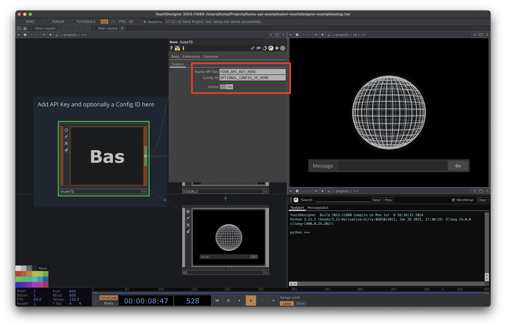
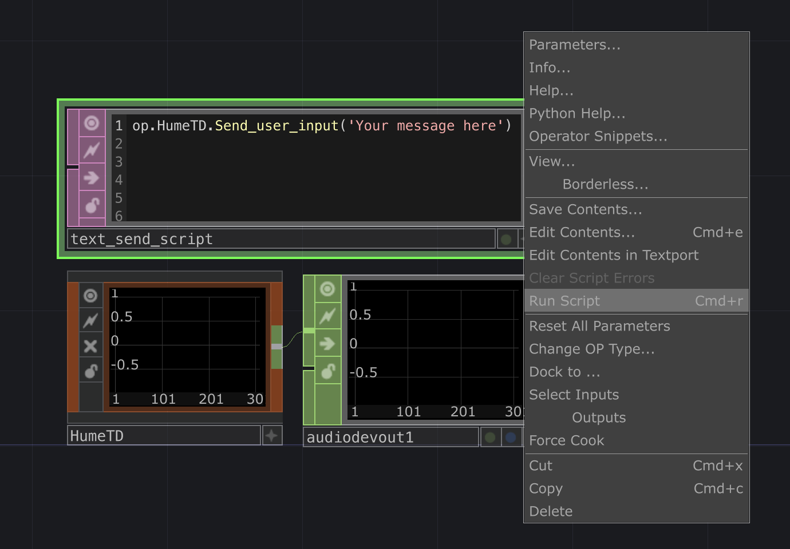

  
  <h1>EVI TouchDesigner Example</h1>

## Overview

This project demonstrates a sample implementation of Hume AI's [Empathic Voice Interface](https://hume.docs.buildwithfern.com/docs/empathic-voice-interface-evi/overview) within a TouchDesigner environment. For now, this project uses text input only.

- `HumeTD.tox` is a portable component you can drop in your own project
- `HumeTDDemo.toe` is a sample project using `HumeTD.tox`

## Setup
Acquire your API key from [platform.hume.ai](https://platform.hume.ai/settings/keys)

## Running the HumeTD demo
1. Open `HumeTDDemo.toe`
2. Select the `HumeTD` component
2. Add your API key in the `Custom` panel of the `HumeTD` component
3. Type your message and click `Go`

## Using `HumeTD.tox` in your own project
1. Drop `HumeTD.tox` into your network
2. Add your API key in the `Custom` panel of the `HumeTD` component
3. *Optional:* Add a custom EVI configuration 
4. You can send a message from any script in your project: `op.HumeTD.Send_user_message('Your message here')`
5. The `HumeTD` component has an audio output with EVI's audio responses

