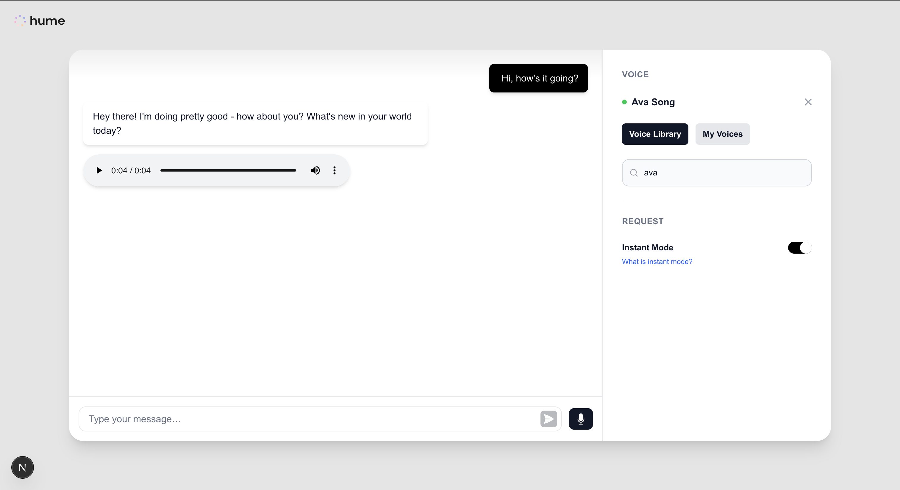

<div align="center">
  
  <h1>Text-to-Speech | Next.js Chat Example</h1>
</div>



## Overview

This project demonstrates how to build a basic streaming conversational interface with [Hume’s TTS (streaming) API](https://dev.hume.ai/reference/text-to-speech-tts/synthesize-json-streaming) that:

- Captures text, or transcribed microphone audio with Groq’s Whisper Large v3 Turbo model.
- Sends the text input to Anthropic’s Claude model using the Vercel AI SDK.
- Streams assistant responses back as text and synthesizes them to audio with Hume’s Octave model.

In addition to demonstrating how to implement TTS streaming for real-time use cases, this project also demonstrates how to:

1. Consume Hume TTS APIs in the browser without exposing your Hume API key (via Next.js backend).
2. How to fetch voices from Hume's [Voice Library](https://platform.hume.ai/tts/voice-library), as well as your own `Custom Voices`, to be listed in your UI.

## Instructions

### Clone this examples repository:

```shell
git clone https://github.com/HumeAI/hume-api-examples
cd hume-api-examples/tts/tts-next-js-chat
```

### Install dependencies:

```shell
npm run install
# or
yarn install
# or
pnpm install
# or
bun install
```

### Set up your API keys:

This project requires API keys for Hume, Anthropic, and Groq. Retrieve them from the [Hume AI platform](https://platform.hume.ai/settings/keys), [Anthropic](https://www.anthropic.com/api), and [Groq](https://groq.com/), then place them in a `.env.local` file:

```shell
echo "HUME_API_KEY=your_hume_api_key" > .env.local
echo "ANTHROPIC_API_KEY=your_anthropic_api_key" >> .env.local
echo "GROQ_API_KEY=your_groq_api_key" >> .env.local
```

### Run the development server:

```shell
npm run dev
# or
yarn dev
# or
pnpm dev
# or
bun dev
```

### Open the app:

Navigate to http://localhost:3000. Use the microphone button to record, click again to stop recording, transcribe speech, send transcription text to Claude, and finally feed Claude's text output to Hume's TTS streaming API to hear Claude's responses voiced with a voice from Hume's voice library or a voice you designed.
