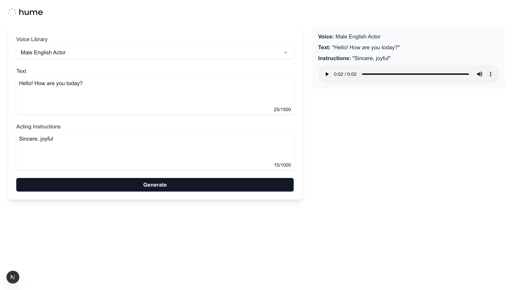

<div align="center">
  
  <h1>Vercel AI SDK | Hume TTS</h1>
</div>



## Overview

This example showcases how to use the [Vercel AI SDK](https://ai-sdk.dev/) to implement [Hume’s Expressive TTS](https://dev.hume.ai/docs/text-to-speech-tts/overview) in a [Next.js](https://nextjs.org/docs) application. The UI consists of a straightforward form—enter text, add acting instructions, choose a voice—and a scrollable gallery of native HTML audio players for each generated clip.

Additionally, this project showcases how to utilize Next.js [Server Actions](https://nextjs.org/docs/13/app/api-reference/functions/server-actions) to securely invoke Hume's TTS API, ensuring that your HUME_API_KEY remains on the server and is not exposed to the browser. It also demonstrates fetching voices from Hume's Hume's [Voice Library](https://platform.hume.ai/tts/voice-library) to populate the UI, using Hume's [TypeScript SDK](https://github.com/HumeAI/hume-typescript-sdk).

## Instructions

### Clone this examples repository:

```shell
git clone https://github.com/HumeAI/hume-api-examples
cd hume-api-examples/tts/tts-next-js-vercel-ai-sdk
```

### Install dependencies:

```shell
npm run install
# or
yarn install
# or
pnpm install
# or
bun install
```

### Set up your API keys:

This project requires a Hume API key. Obtain your API key from the [Hume AI platform](https://app.hume.ai/keys) and then specify it in your `.env.local` file:

```shell
echo "HUME_API_KEY=your_hume_api_key" > .env.local
```

### Run the development server:

```shell
npm run dev
# or
yarn dev
# or
pnpm dev
# or
bun dev
```

### Open the app:

1. **Navigate to** http://localhost:3000 in your browser.
2. **Select a voice from Hume's Voice Library**. The available voices are fetched using Hume's TypeScript SDK.
3. **Enter the text** you wish to synthesize and optionally provide acting instructions to guide the speech's expressiveness.
4. **Click "Generate"** to submit your Text-to-Speech (TTS) request. This action utilizes the Vercel AI SDK to securely call Hume's TTS API via a Next.js Server Action, ensuring your `HUME_API_KEY` remains confidential.
5. **Playback and download** the generated audio clip. Each result appears in a scrollable gallery with a native HTML audio player, allowing you to listen to or save the synthesized speech.
