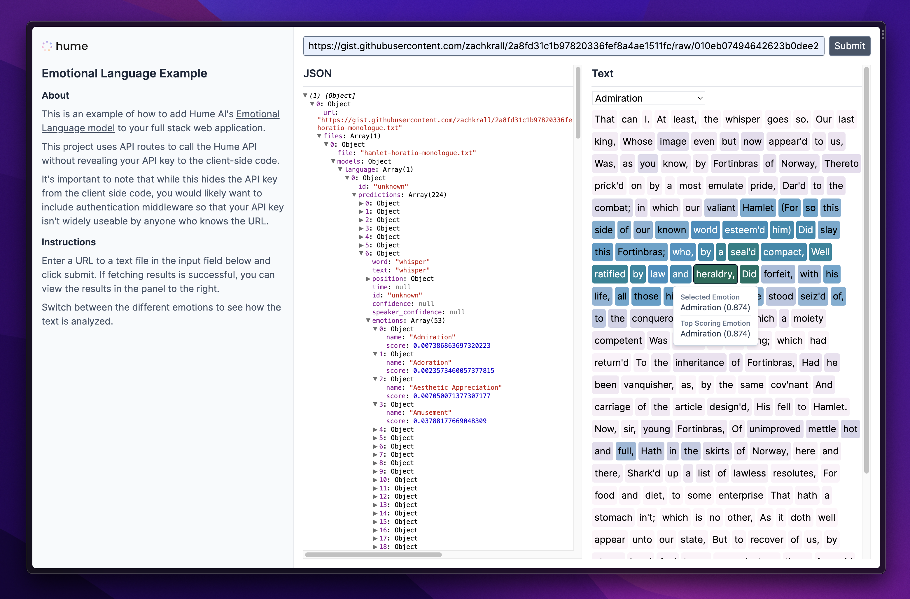

# Next.js Emotional Language Example

| API     | Models     | Framework            |
| ------- | ---------- | -------------------- |
| `batch` | `language` | Next.js (TypeScript) |

[](https://stackblitz.com/fork/github/HumeAI/hume-api-examples/tree/main/typescript-next-api-language)



## Overview

This is an example of how to add Hume AI's Emotional Language model to your full stack [Next.js](https://nextjs.org/) application.

This project uses [API Routes](https://nextjs.org/docs/api-routes/introduction) to call the [Hume API](https://docs.hume.ai). without revealing your API key to the client-side code.

It's important to note that while this hides the API key from the client side code, you would likely want to include authentication middleware so that your API key isn't widely useable by anyone who knows the URL.

## Getting Started

First, create an `.env` file with your [Hume API Key](https://help.hume.ai/developers/quick-start).

```bash
echo "HUME_API_KEY=your api key here" > .env
```

Next, install the required dependencies:

```bash
npm install
```

Then, run the development server:

```bash
npm run dev
```

## Using the App

Open [http://localhost:3000](http://localhost:3000) with your browser.

You should now be able to enter a path to a text file in the input field and see the results of the [Emotional Language](https://docs.hume.ai/doc/batch-api/group/endpoint-batch) endpoint.

If fetching results is successful, you can view the results in the panel to the right.

Switch between the different emotions using the dropdown selector to see how the text is analyzed.
